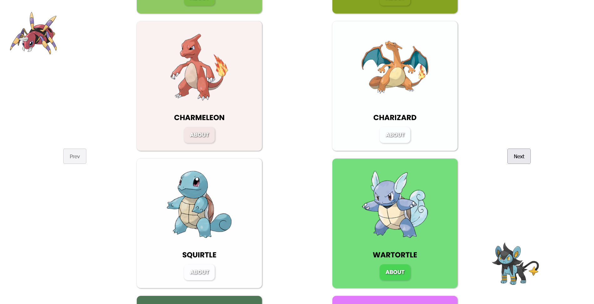

# Pokemon - Catch Them all

This is a personal project/challenge that seeks to use concept i've learnt to create "something that works".
It has helped to improve my coding skills by combinining the following : 
  1. React Js
  2. React Query
  3. Framer Motion
  4. Use of Context
  5. React Responsive Design
  6. Working with REST Api
  7. Tailwind Css (will refactor to).
  8. React Router
  9. Code Documentation (Layout copied from frontendMentor)
  10. Local storage - handled some refresh problem of pages and also cases of network connectivity
  11. Some Skill i dont know about, that maybe caught your attention ... LOL
  

## Table of contents

- [Overview](#overview)
  - [The challenge](#the-challenge)
  - [Screenshot](#screenshot)
  - [Links](#links)
- [My process](#my-process)
  - [Built with](#built-with)
  - [What I learned](#what-i-learned)
  - [Continued development](#continued-development)
  - [Useful resources](#useful-resources)
- [Author](#author)
- [Acknowledgments](#acknowledgments)


## Overview

### The challenge

Users should be able to:

- View the optimal layout for the site depending on their device's screen size
- See hover states for all interactive elements on the page
- Open a new route based on a pokemon clicked
- cycle through a list of pokemons
- see pokemon details after a pokemon has been selected


### Screenshot



### Links

- Solution URL: [Github](https://github.com/Haybuka/Pokemon)
- Live Site URL: [Netlify](https://pok3mun.netlify.app)

## My process

### Built with

- Semantic HTML5 markup
- CSS custom properties
- Flexbox
- CSS Grid
- Desktop-first workflow
- [React](https://reactjs.org/) - JS library
- Framer Motion
- React Query
- React Router
- Pokemon Api 


### What I learned

Use this section to recap over some of your major learnings while working through this project. Writing these out and providing code samples of areas you want to highlight is a great way to reinforce your own knowledge.

To see how you can add code snippets, see below:


```js
  // using React Query
  // first - wrap your app with the QueryClientprovider      
        const queryClient = new QueryClient ()

        <QueryClientProvider client={queryClient}>
          <Pokemon />
        </QueryClientProvider>

  // secondly - create your hook (use an array to pass in parameters for your url, and query key to access them)

    const {data,status} = useQuery(['encounter',url],fetchEncounter)

  // Then, Pass in your function,using the queryKey to access passed in url parameter.

   async function fetchEncounter ({queryKey}){
        const res = await fetch(`${queryKey[1]}`)
        return res.json()
    }
```


### Continued development

   I'm really proud of the progress i made in the building of this app. While the focus was to build something functional it also includes understanding ideas and working with with concepts i felt were difficult to grasp. I do intend to continue building more in order to fully understand the use of context and also to properly split them among routes (i noticed fetching contexts that are tied,leads to more unnecessary reloads), i also will continue to build on the use of framer motion and also react query ( i really found it helpful with pagination, api data request amongst other things).

   To further develop this project, the following are areas that can be looked into,
    1. Creating a versus page (this comes in hand for pokemon battles, the Versus can be either individually or as a team)
    2. Recreating the desktop Ui
    3. Use of a css library(e.g tailwind) to further make the styles open and more easy to follow for those looking to delve into it.

   For my continued development,
      i'll be taking a look at redux, how it affects my current approach towards solving a problem, and how to combine the concept with other frameworks to create something whole.
      Also, i'll be seriously considering learning the use of Markdowns, properly writing a readMe file is equally important.


### Useful resources

- [Pokemon Api](https://pokeapi.co/) - Pokemon Api, well, resource was fetched from this route and i have to say, the documentation did help to get around (just careful not to be lost).
- [Framer Motion](https://www.framer.com/motion/) - I have to say, i didnt expect an animation library to be easy to grasp and also the documentation easier to follow. You'd definetely enjoy reading the documentation made for framer motion, it really helped to get started.
- [React Query](https://react-query.tanstack.com/)
- [React Router](https://reactrouter.com/)


NOTE - you might have issues loading up react query with current react, as query needs a RV16 to properly function (as at April,2022).


## Author

- Website - [Ndulue Paschal](chukwu.netlify.app/)
- LinkedIn - [@paschal-ndulue-336980134](https://www.linkedin.com/in/paschal-ndulue-336980134/)
- Twitter - [@haybukarh](https://www.twitter.com/haybukarh)

